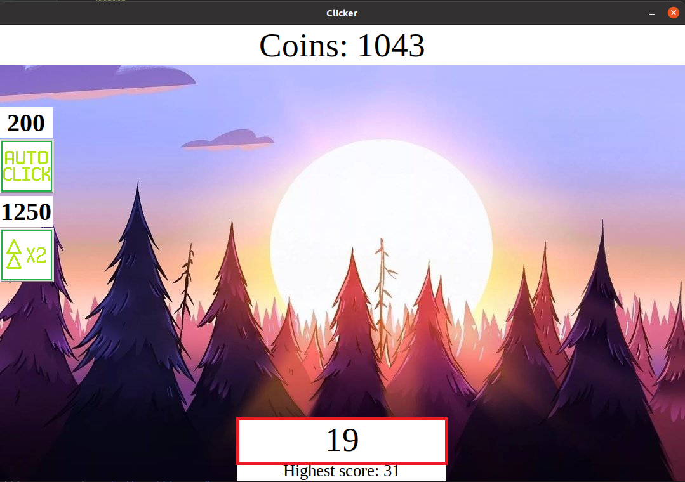
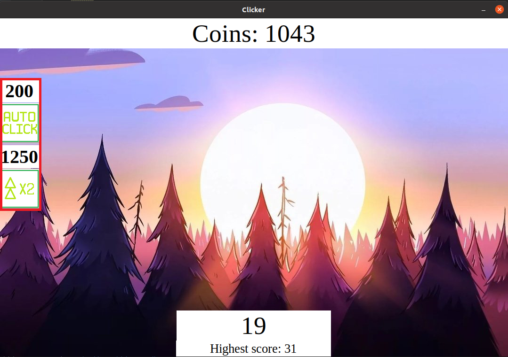
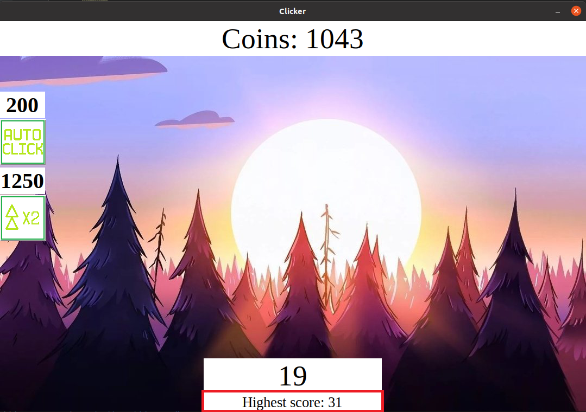

**How to install:**
First, read the requirements for this project. Then continue with this plan:
```bash
	$ git clone https://github.com/AliakseiSuvorau/Clicker.git
	$ cd Clicker
	$ pip install -r requirements.txt
	$ cd src
	$ python3 main.py
```

**How to play:**
1) Push *SPACE* button to get points
2) You can see the amount of clicks you've made at the bottom of the screen:

3) Initially 1 click = 1 point
4) 10 points = 1 coin. 
   You can see your coins at the top of the screen:

5) You can buy upgrades once you've collected enough coins. 
   See the upgrade on the left side of the scree. 
   The price of an upgrade is dislayed above the button. 
   Click the button to purchase an upgrade:

6) Your highest score, that you've got during all the previous runs, 
   is shown under the Label with the clicks on the bottom of the screen:

7) Push the *ESCAPE* button to pause the game.
   To continue push to *ESCAPE* button one more time.

Enjoy! :)
